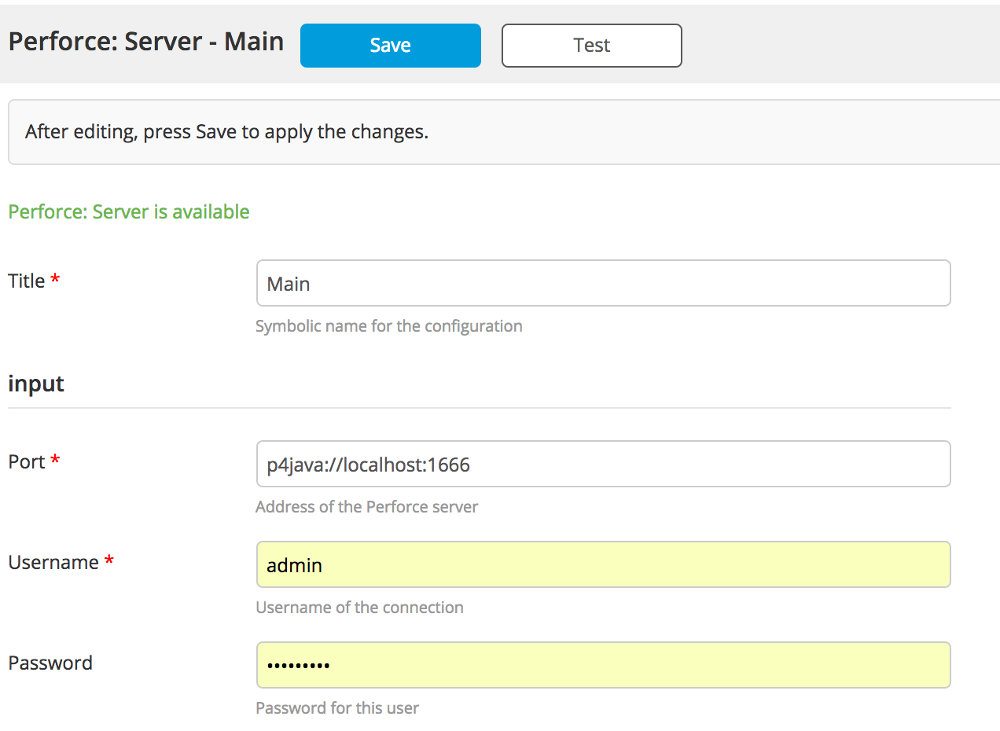
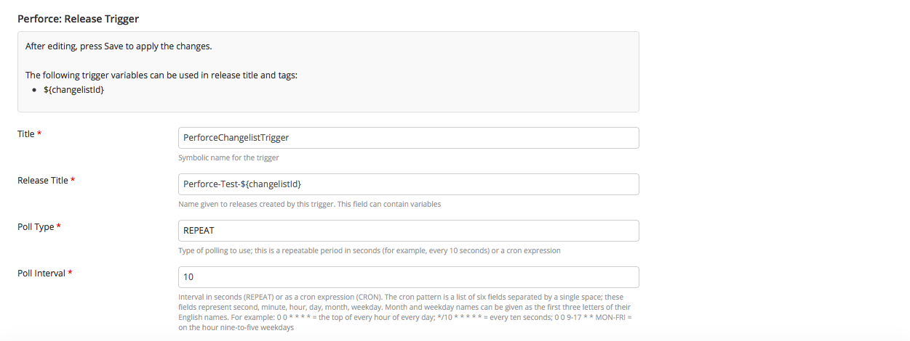
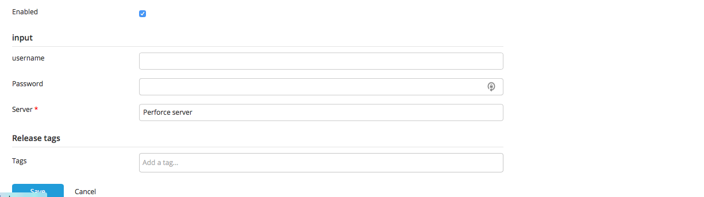

# xlr-perforce-changelist-trigger-plugin

## Overview
1.     The plugin will repeatedly query a Perforce repository using the latest Java interface JAR file (p4java-2015.2.1365262.jar the time of development) for the latest changelist applied to the repo.  The polling interval is configurable.          
2.     Whenever the plugin detects a change in value of the latest changelist id, it will trigger a release off a template in XL Release.  The changelist id is passed to the release as a variable.

## Installation
- Unzip distribution file.
- Copy p4java-2015.2.1365272.jar to xl-release-server/lib.
- Copy xlr-perforce-changelist-trigger.jar to xl-release-server/plugins.
- Restart XL Release server.

## Configuration

#### Perforce server reference
- Define a reference to your Perforce server on the XL Release configuration panel.

#### Perforce trigger
- Then define a release trigger that references the server. Note that the changelist id is available as a trigger variable. 

 

